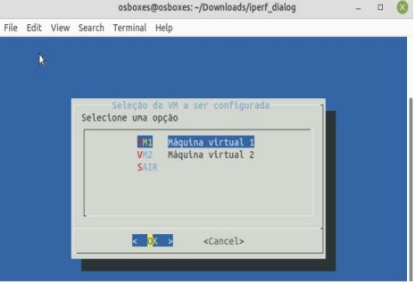

# Dialog

O pacote `Dialog` é uma ferramenta criada originalmente por Savio Lam. Por meio dela é possível obter interfaces gráficas para usuário, para o sistema operacional Linux. Fornecendo caixas interativas, menus, caixas de seleção e outras formas de interação com o usuário em ambientes de linha de comando.

<div align="center">



</div>

## Projeto Dialog

Esse projeto foi criado com objetivo de fazer configurações de redes sem ser por linha de comando. Com o pacote dialog é possível configurar as interfaces, DNS - Domain Name System, visualizar processos, configurações do sistemas, rotas e ainda fazer testes de desempenho de redes por meio da ferramento _Iperf_.

Para uma melhor visualização do Dialog foi implementado de um conjunto de scripts composto por cinco documentos distintos: main.sh, autoip.sh, dns.sh, ip.sh, iperf.sh.

### Arquivo main.sh

O arquivo, main.sh, é responsável por orquestrar a execução das funções principais,divididas em cinco principais funções main(), op_VM1(), conf_list(), route() e process().

-   Função main(): é responsável por iniciar a execução do sistema e chamar as demais funções conforme necessário.
-   Função op_VM1(): realiza operações específicas relacionadas à máquina virtual.
-   Função conf_list(): mostrar as configurações do sistema.
-   Função route() mostra rotas na rede.
-   Função process(), lista os processos da VM e pode executar o comando _Kill_.

### Arquivo autoip.sh

O arquivo autoip.sh realiza configurações automáticas de rede com base nas informações fornecidas pelo usuário. Esse arquivo só tem uma função autoip().

-   A função autoip(): solicita ao usuário informações para configurar automaticamente as interfaces de rede

### Arquivo dns.sh

Já o arquivo dns.sh configura informações de servidor DNS no sistema com base nas informações fornecidas pelo usuário.

-   Função dns(): configura o servidor DNS.

### Arquivo ip.sh

O arquivo ip.sh foi divido em três funções, get_interfaces(), conf_manual_VM1() e interfaces().

-   Função get_interfaces(): retorna as interfaces de rede disponíveis no sistema.
-   Função conf_manual_VM1(): um menu interativo para configurar manualmente as interfaces de rede em uma máquina virtual.
-   A função interfaces(), realiza as configurações das interfaces da máquina virtual com IP, Gateway e Máscara de sub-rede.

### Arquivo iperf.sh

O arquivo iperf.sh realiza as configurações do Iperf. O Iperf é uma ferramenta para medições ativas da largura de banda máxima alcançável em redes IP. Suporta ajuste de vários parâmetros relacionados a temporização, buffers e protocolos (TCP, UDP, SCTP com IPv4 e IPv6). Para cada teste ele relata a largura de banda, perda e outros parâmetros para o envio de um arquivo e de voice. O arquivo do dialog dividido em três funções iperf(), files(), voice().

-   A função ipef(): cria uma interface interativa para a configuração e execução de testes iperf entre um cliente e um servidor.
-   A função files() cria uma interface que coletas informações sobre as configurações do cliente e do servidor para um teste iperf de transferência de arquivos.
-   A função voice() cria uma interface para o usuário que coleta informações sobre as configurações do cliente e do servidor para um teste iperf relacionado ao envio de voz.

## Instalação

Para melhor utilização deste projeto no Ubuntu ou sistemas baseados em Debian, utilize os seguintes comando:

```bash
apt-get install dialog

apt-get install net-tools

apt-get install iperf

apt-get install sshpass
```
